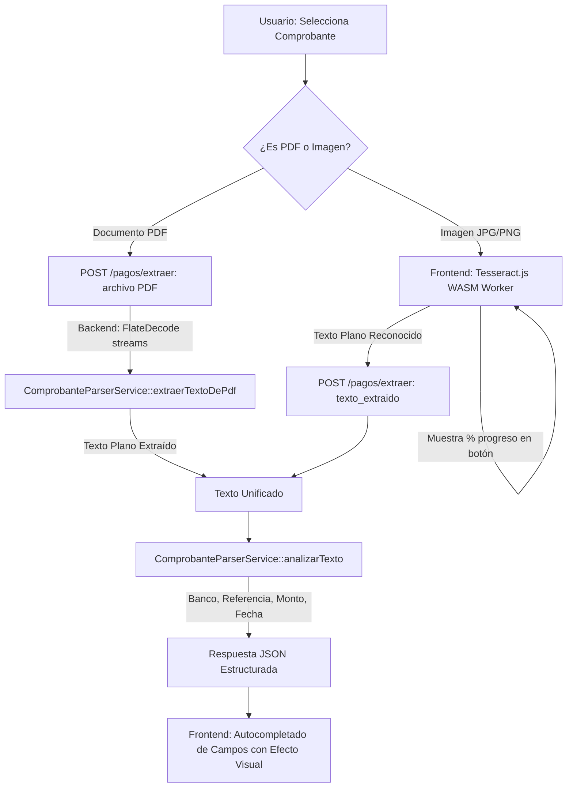

# Diseño de Arquitectura: OCR Agnóstico para Imágenes y PDFs

## 1. Diagrama de Flujo y Componentes



## 2. Contrato de la API

### Endpoint: `POST /pagos/extraer`
* **Cabeceras**: `X-CSRF-TOKEN` o campo `csrf_token` en `POST`
* **Parámetros admitidos**:
  1. `texto_extraido` (string, máx. 50 KB): texto reconocido desde el cliente vía OCR.
  2. `comprobante` (file, máx. 5 MB): archivo PDF para extracción nativa en el servidor.
* **Respuesta JSON**:
  ```json
  {
    "success": true,
    "detectado": true,
    "banco_pagador": "Mercantil",
    "banco_receptor": "Mercantil",
    "referencia": "00987654",
    "monto": 2450.75,
    "fecha_pago": "2026-08-26",
    "mensaje": "Datos extraídos y estructurados exitosamente."
  }
  ```

## 3. Manejo de Fallback
* Si Tesseract.js no logra interpretar el texto o la imagen está borrosa, `analizarTexto()` retorna `{ detectado: false }`.
* El frontend notifica suavemente al usuario: *"No se pudieron extraer todos los datos automáticamente. Por favor complete los campos requeridos manualmente."*
* Nunca se bloquea el formulario ni se impide la subida manual tradicional.
