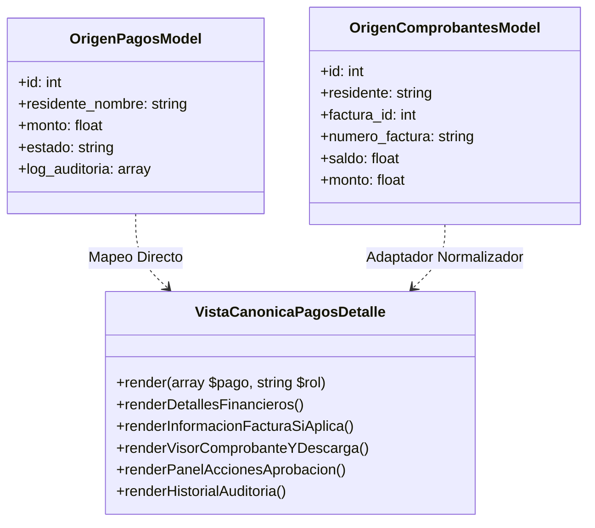

# Diseño Técnico: Unificación de Pantallas de Detalle de Pagos

## 1. Patrón Adaptador para la Vista Canónica

## 2. Implementación del Adaptador
En `app/views/admin/verificar_comprobante.php`, se mapean los campos de `$comprobante` hacia la estructura canónica `$pago`:
- `$pago['id'] = $comprobante['id']`
- `$pago['residente_nombre'] = $comprobante['residente']`
- `$pago['residente_cedula'] = $comprobante['cedula']`
- `$pago['unidad_numero'] = $comprobante['unidad']`
- `$pago['numero_factura'] = $comprobante['numero_factura']`
- `$pago['saldo_factura'] = $comprobante['saldo']`
- `$pago['saldo_restante'] = $saldo_restante`
- `$pago['tipo_origen'] = 'comprobante'`
- `$pago['action_url'] = '/admin/comprobante/verificar?id=' . $comprobante['id']`

Y se incluye/delega en `app/views/pagos/detalle.php`.

## 3. Manejo de Acciones Administrativas
- La vista canónica detecta `$tipoOrigen = $pago['tipo_origen'] ?? 'pago'`.
- Si `$tipoOrigen === 'comprobante'`:
  - Formulario POST con action `/admin/comprobante/verificar?id=...`
  - Campos: `accion = 'aprobar'` o `accion = 'rechazar'`
  - Input de `observaciones`
- Si `$tipoOrigen === 'pago'`:
  - Formulario POST con action `/pagos/cambiar-estado`
  - Campos: `nuevo_estado = 'APROBADO'`, `'EN REVISIÓN'`, `'RECHAZADO'`
  - Input de `motivo`
