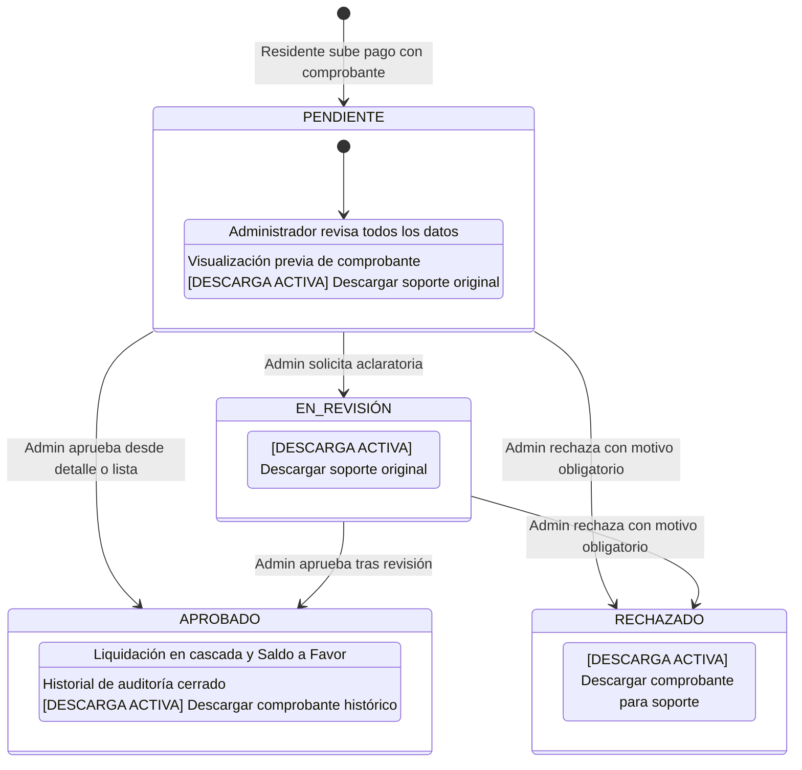

# Diseño Técnico: Visualización y Descarga de Comprobantes en el Flujo de Aprobación

## 1. Arquitectura de Componentes

### 1.1 Proxy Seguro de Entrega y Descarga (`public/comprobante-proxy.php`)
- **Control de Acceso**:
  - Requiere sesión de usuario activa (`$_SESSION['auth_user']['id']`).
  - Autorización: Si el rol es `'residente'`, se valida que el archivo pertenezca a un pago o comprobante asociado a su `residente_id`. Si es `'admin'` o `'auditor'`, se autoriza acceso irrestricto.
- **Mecanismo de Descarga Forzada vs Visualización**:
  - Si `isset($_GET['download']) && $_GET['download'] == '1'`:
    - `header('Content-Disposition: attachment; filename="' . $filename . '"');`
  - Caso contrario:
    - `header('Content-Disposition: inline; filename="' . $filename . '"');`
  - MIME types soportados: `image/jpeg`, `image/png`, `image/webp`, `application/pdf`, `application/octet-stream`.

### 1.2 Máquina de Estados y Transiciones en `PagoController::cambiarEstado`
- Ajustar la matriz de transiciones válidas:
  ```php
  $transicionesValidas = [
      'PENDIENTE'   => ['EN REVISIÓN', 'APROBADO', 'RECHAZADO'],
      'EN REVISIÓN' => ['APROBADO', 'RECHAZADO'],
      'RECHAZADO'   => [],
      'APROBADO'    => [],
  ];
  ```
- Esto permite la aprobación directa desde la vista de detalle cuando el pago se encuentra en estado inicial `PENDIENTE`.

### 1.3 Vista de Detalle y Aprobación (`app/views/pagos/detalle.php`)
- **Corrección de Ruta de Comprobante**:
  - Reemplazar `/uploads/` por `/comprobante-proxy.php?file=` con escape seguro.
- **Sección de Descarga Multiformato**:
  - Enlace de previsualización inline en nueva pestaña (`target="_blank"`).
  - Botón explícito de descarga activa:
    ```html
    <a href="/comprobante-proxy.php?file=<?= e($pago['archivo']) ?>&download=1" 
       download="<?= e($pago['archivo']) ?>" 
       class="btn-descarga">
        <span class="material-symbols-outlined">download</span>
        Descargar Comprobante
    </a>
    ```
  - Esta sección se renderiza independientemente de si el estado es `PENDIENTE`, `EN REVISIÓN` o `APROBADO`.
- **Panel de Acciones Administrativas In Situ**:
  - Cuando `$isAdmin` y el estado es `PENDIENTE` o `EN REVISIÓN`:
    - Formulario POST a `/pagos/cambiar-estado` con `csrf_field()` para Aprobar.
    - Formulario POST a `/pagos/cambiar-estado` con `csrf_field()` para Poner en Revisión (si aplica).
    - Modal o formulario con campo `motivo` para Rechazar.
  - Cuando el pago ya fue aprobado o rechazado:
    - Card de estado final resuelto con auditoría resumida.

### 1.4 Vista de Verificación Administrativa (`app/views/admin/verificar_comprobante.php`)
- Añadir detección de PDF para evitar renderizar `` roto.
- Añadir botón de descarga directa con icono `download` accesible en estado `pendiente`, `aprobado` y `rechazado`.

### 1.5 Tablas de Listado (`app/views/pagos/admin/lista.php` y `app/views/admin/comprobantes.php`)
- Columna dedicada o menú de acción con botón directo de descarga de comprobante en cada fila del listado.

## 2. Diagrama de Flujo del Ciclo de Vida del Pago y Comprobante


